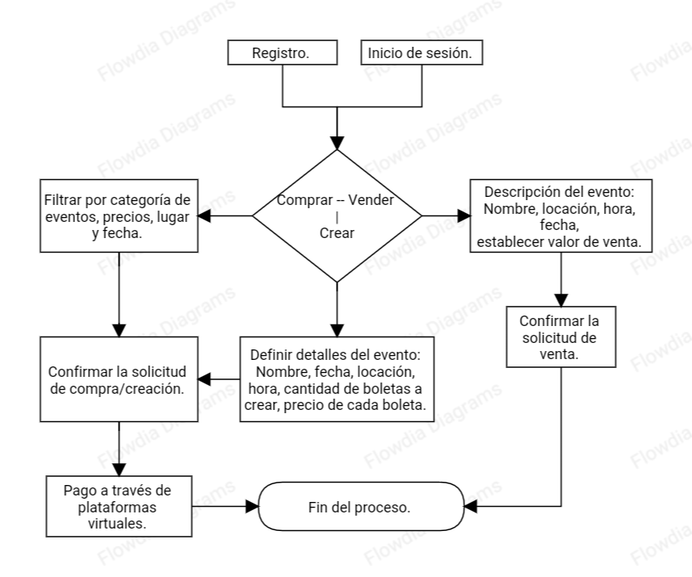

#Proyecto Taller2

Nombre: **All in Tickets**

**Presentacion General**: 

Nuestra pagina se basa en que los usuarios que pertenezcan a ella puedan comprar o vender boletas para eventos especificos (Conciertos, Futbol, Eventos, Etc.).

**Planteamiento del problema**:

 Dia a Dia en grupos de distintas redes sociales se publican miles de compra/ventas de boletas, pero estas son muy dispersas y se pierden entre otras muchas publicaciones, nuestra pagina ayuda a que esto tenga su propio lugar y con tan solo un par de clicks puedas vender o comprar tus boletas.

**Descripcion del proceso**: 

Se realizara una pagina web donde las personas podran entrar y ver distintos tipos de boletas y podran comprar o vender en caso de tener alguna, al comprar una esta se le notificara al vendedor que se comunicara directamente con el cliente para hacer la compra.

**Justificacion**:

 esta pagina ayudara a facilitar la comprar/venta de boletas, darle un espacio a este gran mercado.

**Descripcion de la propuesta**:

 el poryecto planteado permitira entrar a la pagina web donde el usuario podra registrarse o en caso de ya estarlo de ingresar, al entrar se le dara la opcion de querer comprar o venden, en la seccion de vender tendra la opcion de filtrarlo por evento (ya se concierto, boleta futbol, ETC) y subir una foto con su factura de compra y su posteriormente su precio. En la seccion de comprar se buscara por evento y apareceran todas las boletas publicadas por los usuario

**DIAGRAMA DE EXPERIENCIA DE CLIENTE**:

### Observaciones Entregable Uno.
- Más orden al momento de presentar la idea.
- Tener en cuenta la ortografía
- Respecto al tablero, no lo actualizaron.
- Tengo en cuenta que hayan actualizado el diagrama que me debían.
- No hay información de los integrantes de este grupo en su README.md por favor me envían un correo con los integrantes.

#### Nota: 3,7
