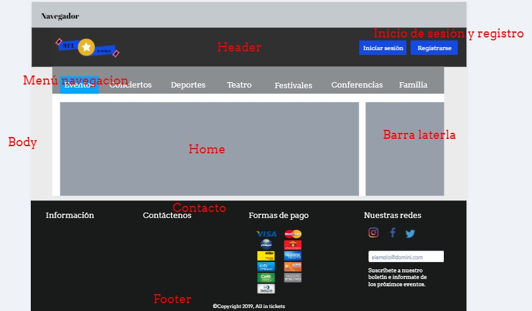

<h1>PROYECTO ALL IN TICKETS</h1>

---

<h4>Universo del discurso All-In-Tickets</h4>

Se requiere llevar los datos del proyecto *All in tickets*, para ello se deben de tener en cuenta
lo siguiente

1. Se lleva el control del registro del usuario, a este se le pedirán los siguientes datos:
Cedula (con este se verifica que sea mayor de edad para asistir a algunos eventos
con dicha restricción) nombre, apellido, correo electrónico, contraseña, dirección y
teléfono, de lo cual al momento del ingreso en la página solo se deberá tener en
cuenta el correo y la contraseña.
2. Se lleva control de la creación de eventos, estos tendrán la siguiente información:
Ubicación, dirección del evento, capacidad, fecha del evento y una breve
descripción de este mismo (Música, partido, etc...) Se debe tener en cuenta que un
usuario puede crear un evento en la página pero este solo será publicado si un
administrador de la página lo aprueba al confirmar que la información sea verídica,
así se llevara control de la página y evitar posibles eventos falsos.
3. La boleta para dichos eventos será totalmente virtual y será creada por el usuario y
publicada por la pagina cuando el administrador confirme el evento, la boleta debe
tener los siguientes datos en ella: identificación única para cada boleta (ID), tipo de
boleta, ubicación de la boleta.
4. Al comprar una boleta, esta deberá llevar las siguientes especificaciones: Nombre
del evento a la que pertenecer la boleta, su precio, Ubicación del evento, numero de
boletas que desea comprar (este tendrá un límite de 3 boletas por cedula), también al
final de la compra se podrá escoger su medio de pago.

**Modelo entidad relacion de All In Tickets**

---

**Diagrama UML - Diagrama caso de uso**

---

**Mockup pagina principal**

---